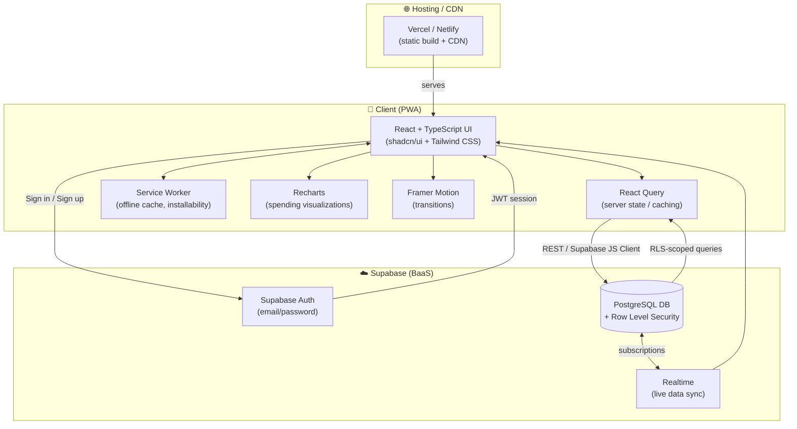

# Minimalist Expense Tracker PWA

A modern, mobile-first **Progressive Web App (PWA)** designed for seamless personal finance management. Built with a focus on minimalism, speed, and "Apple-style" aesthetics, this application allows users to track expenses, visualize spending habits, and maintain financial discipline without the clutter.

## 🚀 Key Features

* **Premium Minimalist UI:** A clean, monochrome interface utilizing **shadcn/ui** components for a professional look.
* **Smart Dashboard:** Real-time balance updates, monthly limits, and visual budget tracking.
* **Data Visualization:** Interactive donut charts powered by **Recharts** to analyze spending categories.
* **Secure Authentication:** Email/Password login powered by **Supabase Auth** with strict Row Level Security (RLS) to ensure data privacy.
* **PWA Support:** Installable on iOS and Android devices as a native-feeling app (offline capable).
* **Responsive Design:** Optimized for mobile viewports using dynamic viewport units (`dvh`) to prevent layout issues.

## 🛠️ Tech Stack

* **Frontend:** React, TypeScript, Vite
* **Styling:** Tailwind CSS, shadcn/ui
* **Backend:** Supabase (PostgreSQL, Auth, Realtime)
* **State Management:** React Query (TanStack Query)
* **Animation:** Framer Motion

## 🏗️ System Architecture

Yash Finance follows a **client-driven, BaaS (Backend-as-a-Service) architecture** — there's no custom backend server. The React PWA talks directly to Supabase for auth, data, and realtime sync, with Row Level Security enforcing data isolation at the database layer.

### Component Breakdown

| Layer | Responsibility |
|---|---|
| **UI Layer** | React + TypeScript components styled with Tailwind CSS and shadcn/ui; renders dashboard, transaction forms, and category views |
| **State Management** | React Query manages server state, caching, and background refetching of Supabase data |
| **Data Visualization** | Recharts renders donut charts for category-wise spending breakdown |
| **Auth** | Supabase Auth issues JWTs on email/password login; session persisted client-side |
| **Database** | PostgreSQL on Supabase, with Row Level Security ensuring each user can only access their own records |
| **Realtime** | Supabase Realtime pushes live updates (e.g. new transactions) to subscribed clients |
| **Offline/PWA** | Service worker caches assets/data for offline use and enables install-to-homescreen |
| **Hosting** | Static build deployed via Vercel/Netlify, served over CDN |

### Data Flow (typical transaction add)
1. User submits a new expense via the UI form
2. React Query fires a mutation → Supabase client sends an insert request
3. Postgres validates the write against RLS policies (user can only write to their own `user_id` rows)
4. Supabase Realtime broadcasts the change
5. React Query cache is invalidated/updated → dashboard and charts re-render
* **Deployment:** Netlify / Vercel

